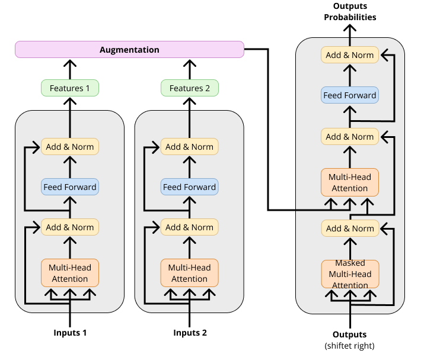

# <div align="center"> Dataugmentaion for Transformer based Multivariate Time Series Forcasting </div>

<div align="center">
Code for my masters thesis where I will investigate the impact of manifold mixup data augmentation has on model performance. 
</div>

<div align="center">

</div>

> Multivariate Time Series (MTS) forecasting plays a vital role in a wide range of applications. Manifold Mixup describes a technique where data is augmented in the manifold of the nwtwork, instead at the input. Since the manifold in trained neuiral networks represents a compressed representaion of the input information, interploating between samples can yield new, augmented samples, that during finetuning can sharpen the decision boundires. In this thesis I propose to use the same technique that has been showen to be efficient in autoencoders and the BERT transforme encoder architecture in a MTS transformer encoder-decoder architecture. 

## 📚 Table of Contents

**data** 
> Unidentifiable data regarding patiens on the Neurological Intensive Care Unit (ICU). The raw data cannot be accessed.
> 
**data_air** 
> Beijing Multi-Site Air-Quality Data. To test the methodology of the manifold mixup, we first try it out on a easier interpretable dataset, then the ICU patient data

**figures** 
> Different figures (architecture, performance, eda)


## 💿 Requirements

The code is built based on Python 3.9, PyTorch 1.10.0

After ensuring that PyTorch is installed correctly, you can install other dependencies via:

```bash
pip install -r requirements.txt
```

## 📑 Methods
I will use the basic transformer architeture as a baseline. I will compare the Manifild Mixup technique to the spaceitimeformer. The spacetimeformer is a specifal embedding methodology that alows to capture not only temporal information between time steps, but a compination of temporal and spatial information. Additionally, I will combine the Manifold Mixup and Spacetimeformer architecture.

- Transformer
- Transformer + Manifold Mixup
- Spacetimeformer 
- Spacetimeformer + Manifold Mixup

Since time-series data is not easily interpretable by humans, I will use PCA and t-SNE to map the multi-dimensional output sequence vectors into two dimensions to visually observe the similarity in the distribution of the synthetic data and real data instances.
## 📊 Performance and Visualization


